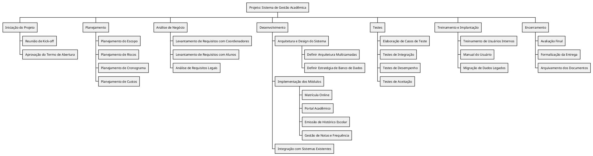
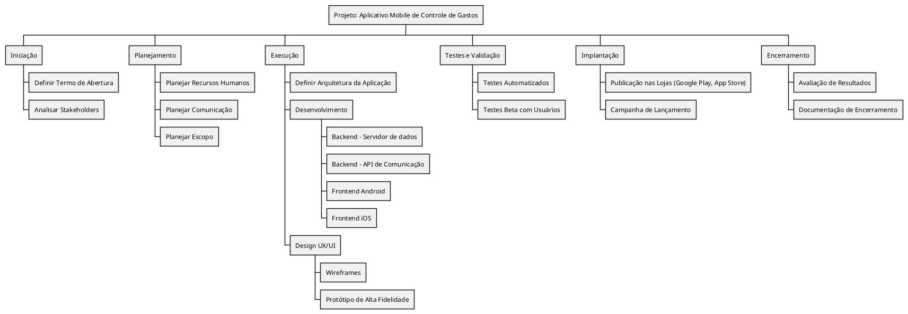
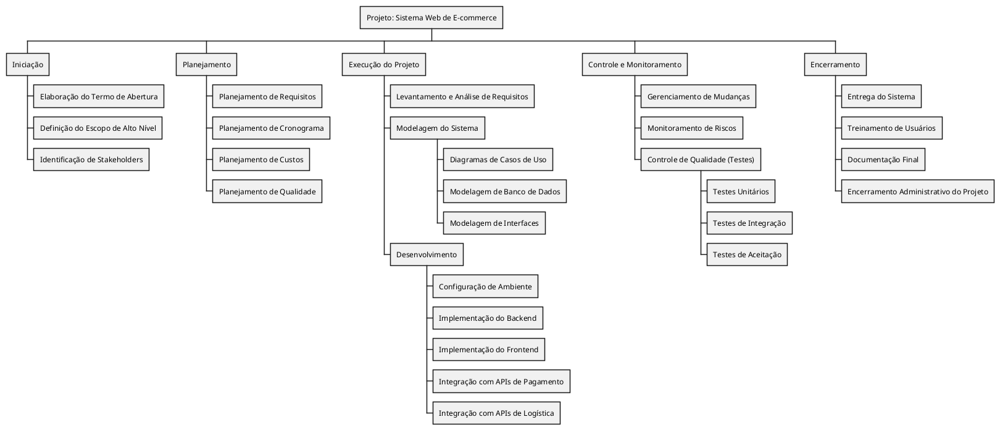

# Exemplos de EAP

## Exemplo 1

EAP para “Desenvolvimento de um Sistema Web de E-commerce”

1. Iniciação
 1.1 Elaboração do Termo de Abertura
 1.2 Definição do Escopo de Alto Nível
 1.3 Identificação de Stakeholders

2. Planejamento
 2.1 Planejamento de Requisitos
 2.2 Planejamento de Cronograma
 2.3 Planejamento de Custos
 2.4 Planejamento de Qualidade

3. Execução do Projeto
 3.1 Levantamento e Análise de Requisitos
 3.2 Modelagem do Sistema
  3.2.1 Diagramas de Casos de Uso
  3.2.2 Modelagem de Banco de Dados
  3.2.3 Modelagem de Interfaces
 3.3 Desenvolvimento
  3.3.1 Configuração de Ambiente
  3.3.2 Implementação do Backend
  3.3.3 Implementação do Frontend
  3.3.4 Integração com APIs de Pagamento
  3.3.5 Integração com APIs de Logística

4. Controle e Monitoramento
 4.1 Gerenciamento de Mudanças
 4.2 Monitoramento de Riscos
 4.3 Controle de Qualidade (Testes)
  4.3.1 Testes Unitários
  4.3.2 Testes de Integração
  4.3.3 Testes de Aceitação

5. Encerramento
 5.1 Entrega do Sistema
 5.2 Treinamento de Usuários
 5.3 Documentação Final
 5.4 Encerramento Administrativo do Projeto

---

## Exemplo 2

EAP para “Aplicativo Mobile de Controle de Gastos Pessoais”

1. Iniciação
 1.1 Definir Termo de Abertura
 1.2 Analisar Stakeholders

2. Planejamento
 2.1 Planejar Recursos Humanos
 2.2 Planejar Comunicação
 2.3 Planejar Escopo

3. Execução
 3.1 Definir Arquitetura da Aplicação
 3.2 Desenvolvimento
  3.2.1 Backend – Servidor de dados
  3.2.2 Backend – API de Comunicação
  3.2.3 Frontend Android
  3.2.4 Frontend iOS
 3.3 Design UX/UI
  3.3.1 Wireframes
  3.3.2 Protótipo de Alta Fidelidade

4. Testes e Validação
 4.1 Testes Automatizados
 4.2 Testes Beta com Usuários

5. Implantação
 5.1 Publicação nas Lojas (Google Play, App Store)
 5.2 Campanha de Lançamento

6. Encerramento
 6.1 Avaliação de Resultados
 6.2 Documentação de Encerramento

---

## Exemplo 3

EAP para “Sistema de Gestão Acadêmica para Universidade”

1. Iniciação do Projeto
 1.1 Reunião de Kick-off
 1.2 Aprovação do Termo de Abertura

2. Planejamento
 2.1 Planejamento do Escopo
 2.2 Planejamento de Riscos
 2.3 Planejamento de Cronograma
 2.4 Planejamento de Custos

3. Análise de Negócio
 3.1 Levantamento de Requisitos com Coordenadores
 3.2 Levantamento de Requisitos com Alunos
 3.3 Análise de Requisitos Legais

4. Desenvolvimento
 4.1 Arquitetura e Design do Sistema
  4.1.1 Definir Arquitetura Multicamadas
  4.1.2 Definir Estratégia de Banco de Dados
 4.2 Implementação dos Módulos
  4.2.1 Matrícula Online
  4.2.2 Portal Acadêmico
  4.2.3 Emissão de Histórico Escolar
  4.2.4 Gestão de Notas e Frequência
 4.3 Integração com Sistemas Existentes (ex: Biblioteca, Financeiro)

5. Testes
 5.1 Elaboração de Casos de Teste
 5.2 Testes de Integração
 5.3 Testes de Desempenho
 5.4 Testes de Aceitação pelo Cliente

6. Treinamento e Implantação
 6.1 Treinamento de Usuários Internos
 6.2 Manual do Usuário
 6.3 Migração de Dados Legados

7. Encerramento
 7.1 Avaliação Final
 7.2 Formalização da Entrega
 7.3 Arquivamento dos Documentos

## Modelos em PlantUML

### Projeto gestão acadêmica:

### Projeto de gastos pessoais

### Projeto do E-commerce:

## Exercício de Prática – EAP de Projeto de Software

Tema: Desenvolvimento de um Sistema de Agendamento de Consultas para uma Clínica Médica

---

Escopo do Projeto

A Clínica Saúde Prime precisa de um Sistema Web que permita que pacientes agendem suas consultas online.
O sistema deve ter funcionalidades para:
 - Cadastro de Pacientes.
 - Cadastro de Médicos.
 - Cadastro de Especialidades.
 - Agendamento de Consultas.
 - Cancelamento e Remarcação de Consultas.
 - Visualização da Agenda do Médico.

Deve haver também uma área administrativa para a clínica controlar os cadastros e as agendas.

O projeto será desenvolvido internamente em 5 meses, com equipe própria de TI da clínica.

---

Tarefas

1.	Criar a EAP (Estrutura Analítica do Projeto) baseada nesse escopo, organizando os principais pacotes de trabalho.
2.	Representar a EAP em PlantUML usando o estilo @startwbs.
3.	Criar um pequeno Dicionário da EAP, descrevendo o que é cada pacote de trabalho principal.

